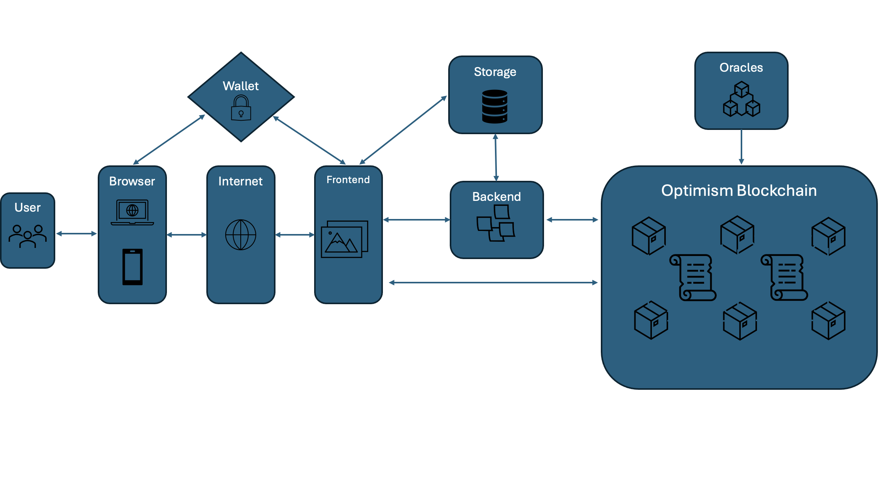
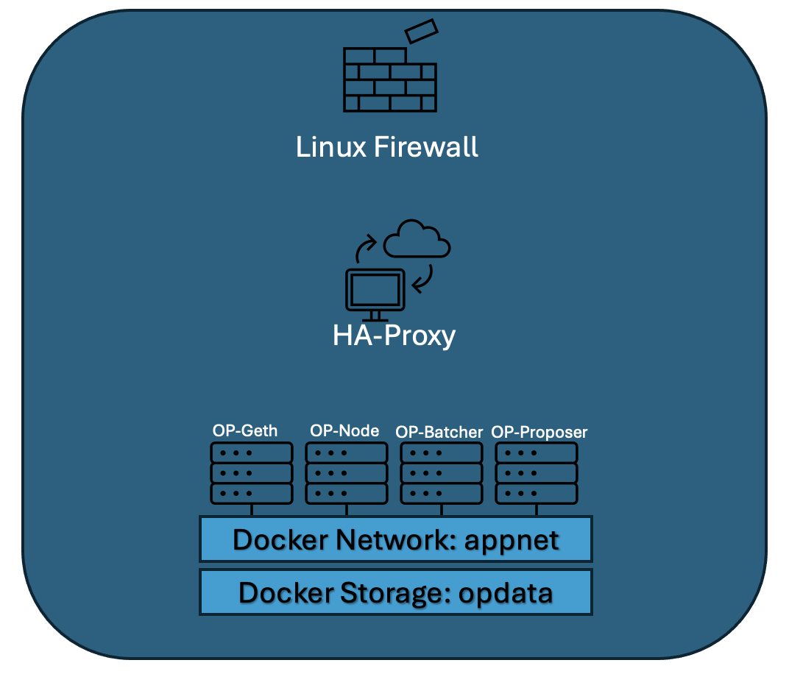

# fantastic-enigma

For this technical challenge, I’ve chosen specifically the OP Stack framework, as it offers an adaptable, modular, and observable foundation for a decentralized application (dApp) platform. The OP Stack is well-suited to meet enterprise requirements around security, deployment flexibility, and observability. Here’s why it stands out:

*   1. Modular Architecture for Customization
OP Stack’s modular, open-source design allows developers to build custom blockchains optimized for specific requirements, supporting a simple yet adaptable network. Each layer can be customized with specific functionalities, such as security-focused modules, ensuring adaptive security throughout the system.

*   2. Layer 2 Scalability and Efficiency
Optimism, as a Layer 2 solution, inherits Ethereum’s robust security while providing faster transactions and lower costs. This approach supports high-throughput applications needing low-latency blockchain interactions and allows for efficient backend and frontend interactions without sacrificing security.

*   3. Built-in Security: Fraud Proofs and Rollup Architecture
The OP Stack employs optimistic rollups with fraud-proof mechanisms, enabling adaptive security by initially assuming transactions are valid, with fraud checks only when needed. This design supports rapid finality with a trust-minimized approach to meet the demands of secure, enterprise-grade blockchain applications.

*   4. Interoperability with Ethereum Ecosystem
The OP Stack seamlessly integrates with the Ethereum ecosystem, supporting Ethereum-compatible smart contracts and tools, making it straightforward to link Node.js backend services and frontend applications. Using OP Stack leverages Ethereum’s security protocols and mature tooling, enabling quicker, safer development and deployment.

*   5. Comprehensive Observability and Monitoring Tools
OP Stack includes essential observability features like metrics, logging, and alerting, which can be integrated with tools like Prometheus and Grafana. Additionally, its rollup structure on the Ethereum mainnet ensures transparent data tracking across Layers 1 and 2, supporting full end-to-end observability for enterprise-level system monitoring.

*   6. Deployment Flexibility and Infrastructure Compatibility
Designed for flexible deployment, OP Stack runs on various cloud providers and is compatible with Docker and Kubernetes, simplifying cloud automation with modern CI/CD practices. Integration with tools like Ansible and Terraform facilitates automated deployment pipelines and management of blockchain infrastructure in an enterprise environment.

*   7. Community-Driven Development and Future-Proofing
OP Stack benefits from Ethereum’s open-source community, fostering continuous innovation and security updates. The Optimism Collective actively supports public goods funding and Layer 2 advancements, ensuring OP Stack remains future-proof and responsive to emerging needs, especially for enterprise security and scalability.

Here is an overview diagram of the Optimism blockchain environment:

This diagram outlines the key components and their interactions within the Optimism blockchain setup. It includes core infrastructure, such as the backend and frontend applications integrated with Optimism’s Layer 2 blockchain and deployment layers. Each element highlights how the environment leverages Optimism’s scalability, Ethereum compatibility, and modularity to create a secure, efficient, and enterprise-ready dApp platform.

### 1. Architectural Overview Diagram

The diagram includes the following high-level components and their interconnections:

#### Frontend (UI): 
*   Interfaces with the backend API layer to interact with blockchain data.

#### Backend (Node.js APIs): 
*   Manages business logic, authentication, and data handling for the dApp.

#### Optimism Layer 2 Blockchain: 
*   Connects with Ethereum L1 as the security layer and includes modules for smart contracts, fraud proofs, and the rollup architecture.

### Infrastructure Components:
*   AWS Environment: Hosts the backend, frontend, and blockchain nodes.
*   VPC, Subnets, Security Groups: Ensures network segmentation and access control.
*   Observability Stack: Integrates Prometheus, Grafana, logging, and alerting.
*   Automation Layer: Utilizes Terraform, Ansible, and CI/CD pipelines for IaC and streamlined deployments.

### 2. Security Threat Analysis
The multi-layered security approach includes:

#### Threat Modeling:

*   Identify risks across the app, blockchain, and infrastructure layers.
*   Evaluate specific Layer 2 risks (e.g., fraud proofs, optimistic rollup).

#### Identity and Access Management (IAM):

*   Enforce strict IAM with role-based access control (RBAC) and multi-factor authentication (MFA) on AWS.
*   Use an identity provider for SSO and OAuth2 to authenticate dApp users.

#### Key Rotation and Management:

*   Secure private keys via AWS KMS or HashiCorp Vault for backend communication.
*   Regularly rotate access keys and implement robust key management policies.

### 3. Observability Implementation Solution
An integrated observability stack provides detailed insights across all components:

#### Distributed Tracing:

*   Enable distributed tracing across frontend, backend, and blockchain components to track request paths and latency.
*   Leverage tools like Jaeger or OpenTelemetry to collect and trace data across services.

#### Real-Time Performance Metrics:

*   Use Prometheus to gather backend, frontend, and infrastructure metrics.
*   Grafana dashboards display metrics such as transaction times, API response latency, and resource utilization.

#### Comprehensive Logging:

*   Implement centralized logging with the ELK stack to monitor all services, enabling rapid troubleshooting.
*   Set up anomaly detection alerts for unusual patterns in logs.

### 4. Deployment and Automation Solution
For a highly automated and scalable environment:

#### Infrastructure Automation:

*   Use Terraform for automated provisioning of VPCs, subnets, and EC2 instances.
*   Ansible for configuration management (e.g., security patches, app deployment).

#### CI/CD Pipelines:

*   Implement CI/CD pipelines (e.g., GitHub Actions, Jenkins) to automate deployments, tests, and rollbacks.
*   Integrate with Docker to build and deploy backend and frontend applications consistently.

#### Horizontal Scalability:

*   Use autoscaling groups and load balancers on AWS to handle variable traffic.
*   Cluster blockchain nodes using Docker Swarm or Kubernetes, enabling distributed processing.

### 5. Governance Model

#### Upgrade Mechanisms:

*   Implement upgrade processes for the blockchain network using governance smart contracts that allow for vote-based updates.
*   Implement CI/CD to support fast rollback or upgrades for application and infrastructure.

#### Resource Allocation Strategies:

*   Track resource usage with metrics to forecast capacity needs.
*   Implement auto-scaling based on demand and metrics thresholds.

#### Compliance and Regulatory Adaptability:

*   Maintain regular security reviews and audit logging to ensure compliance.
*   Use services (e.g., AWS CloudTrail) for audit trails to satisfy regulatory requirements.

## Solution Overview: Terraform Deployment for Optimism OP Stack Node in AWS
In this solution, I used Terraform to deploy an Optimism OP Stack demo node on AWS, adhering to best practices in infrastructure setup and security configuration. Key steps and considerations included:

### 1. Infrastructure as Code (IaC) with Terraform:

*   Utilized Terraform to define and provision all AWS resources, ensuring consistent, repeatable deployments.
*   This IaC approach allows for easy scaling, modification, and version control of the entire infrastructure setup.

### 2. Security Best Practices:

*   SSH Access: Exported an SSH public key to the deployed instance, allowing secure, encrypted access while minimizing unauthorized access risks.
*   Restricted Ports: Opened only the specific ports required by Optimism OP Stack components, reducing the attack surface and ensuring that only essential services are accessible.

### 3. AWS Components:

*   VPC: Deployed within a Virtual Private Cloud (VPC) to isolate and secure network resources.
*   Security Group: Configured to control inbound and outbound traffic, with rules specifically tailored to OP Stack’s needs.
*   Subnet and Internet Gateway: Configured for routing and internet access, with a route table linked to the subnet.
*   EC2 Instance: Launched an instance with the necessary resources and permissions to host the OP Stack demo, applying custom configuration through Terraform.

This deployment strategy combines Terraform’s automation and AWS’s robust infrastructure, creating a scalable, secure, and efficient environment for running Optimism’s OP Stack components on AWS.

For node management, Ansible is used to automate the deployment of all OP Stack components as Docker containers. To enhance security, HAProxy is configured as a reverse proxy, and an iptables firewall is employed to restrict access to only the necessary ports on the node. Key OP Stack components, such as op-geth and op-node's P2P port, are exposed to the internet, while other RPC and WSS services are routed through HAProxy. 

Please find the diagram below outlining the components within the nodes. 

